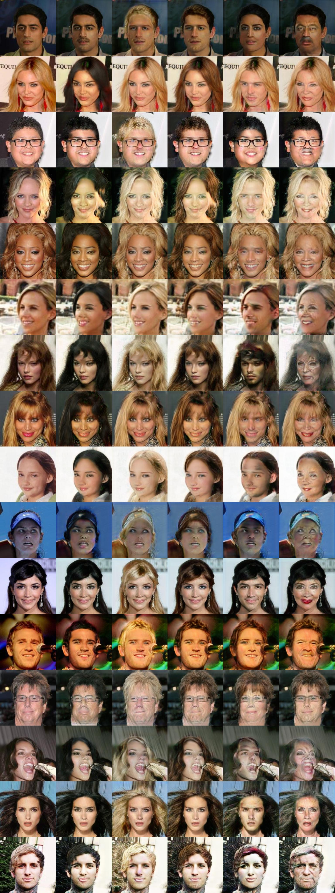
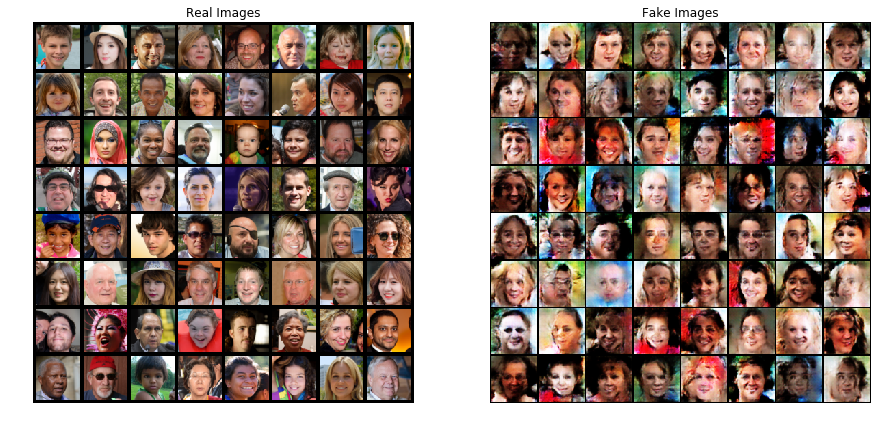
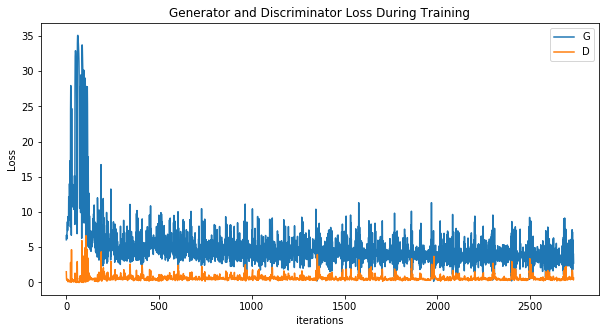
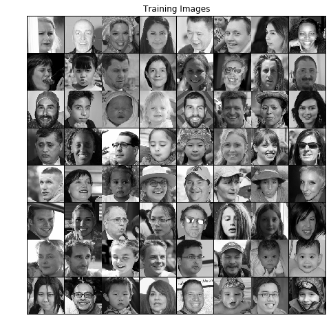
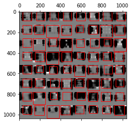
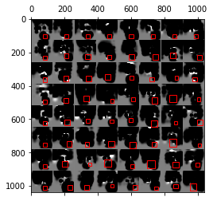
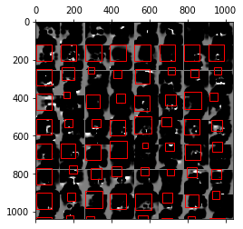

# dlb2018_team1
Deep Learning Basics 2018 Team1

Hironobu-Kawaguchi

- StyleGAN

    StyleGAN Style Mixing

    ```
    git clone https://github.com/NVlabs/stylegan
    ```

    styleganフォルダで下記を実行(Jupyter NotebookでもOK)

    src_seeds: 横の5人のrandom.seed（元から変えてます）

    dst_seeds:縦の6人のrandom.seed（元のままです）
    ``` python
    import os
    from generate_figures import *

    png_f = 'hktest01-style-mixing.png'
    tflib.init_tf()
    os.makedirs(config.result_dir, exist_ok=True)
    draw_style_mixing_figure(os.path.join(config.result_dir, png_f), load_Gs(url_ffhq), w=1024, h=1024, src_seeds=[5,1967,1555,91,388], dst_seeds=[888,829,1898,1733,1614,845], style_ranges=[range(0,4)]*3+[range(4,8)]*2+[range(8,18)])
    PIL.Image.open(os.path.join(config.result_dir, png_f))
    ```

    

- StarGAN

    CelabAを使ってStarGAN

    ```
    git clone https://github.com/yunjey/StarGAN
    ```

    学習済みモデル(celeba 256)を入れて、Anaconda Promptで下記を実行(Windows環境、batchfile にして実行がGood)  
    ```
    python main.py --mode test --dataset CelebA --image_size 256 --c_dim 5 ^
                 --celeba_image_dir E:/data/CelebA/Img/img_align_celeba/img_align_celeba/ ^
                 --attr_path E:/data/CelebA/Anno/list_attr_celeba.txt ^
                 --selected_attrs Black_Hair Blond_Hair Brown_Hair Male Young ^
                 --model_save_dir stargan_celeba_256/models/ ^
                 --result_dir stargan_celeba_256/results/
    ```

    

- torchvision_models_predict.ipynb

    学習済みモデル(torchvison.models)を使って、画像分類(ImageNet 1000class)

    公式Doc https://pytorch.org/docs/stable/torchvision/models.html

- torchvision_models_predict_dataloader.ipynb

    学習済みモデル(torchvison.models)を使って、画像分類(ImageNet 1000class)

    ffhq_1024x1024dataset 7万枚を、dataloaderを使って分類、GPUにも対応

    上位は、かつら、ネクタイ、バンドエイド、スーツ、シートベルトなど

- ffhq_dcgan_20190218.ipynb

    ffhq_128x128datasetを使って、DCGAN

    元ソース https://pytorch.org/tutorials/beginner/dcgan_faces_tutorial.html

    
    

- ffhq_DRAW_20190218.ipynb

    ffhq_128x128datasetをGrayScaleにしてDRAWで学習

    ffhq_128x128dataset

           
        


- [ffhq-dataset 128x128 70,000枚(ZIP)](https://1drv.ms/u/s!AvHteFLdGh-Dk6ADkTBKk1ngn7unDw)
