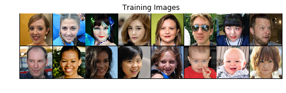
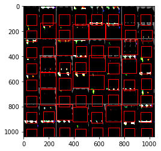
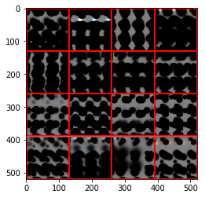

# dlb2018_team1
Deep Learning Basics 2018 Team1

Hironobu-Kawaguchi

- torchvision_models_predict.ipynb

学習済みモデル(torchvison.models)を使って、画像分類(ImageNet 1000class)

    公式Doc https://pytorch.org/docs/stable/torchvision/models.html

- ffhq_dcgan_20190218.ipynb

    ffhq_128x128datasetを使って、DCGAN

    元ソース https://pytorch.org/tutorials/beginner/dcgan_faces_tutorial.html

- ffhq_DRAW_20190216.ipynb

    ffhq_128x128datasetをDRAWで学習させてようとしてMemory Errorになった処理(batch_size=64)

    ffhq_128x128dataset

    batch_size=64の最後のoutput

- ffhq_DRAW_20190216.ipynb

    ffhq_128x128datasetをDRAWで学習させてようとしてMemory Errorになった処理(batch_size=16)

    batch_size=16の最後のoutput

- [ffhq-dataset 128x128 70,000枚(ZIP)](https://1drv.ms/u/s!AvHteFLdGh-Dk6ADkTBKk1ngn7unDw)
